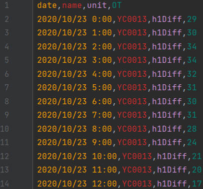
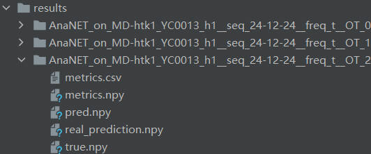
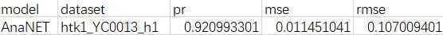

## 环境准备
所需要的conda依赖放置在`env.yaml`中，pip安装的依赖放置在`requirements.txt`中，先使用conda进行安装
```bash
    $ conda env create -f env.yaml
```

再使用pip进行安装
```bash
    $ pip install -r requirements.txt
```

## 数据准备
请确保所有数据集具备`date`和`OT`列，分别对应时间戳与时序数据。

进行小时任务时，请确保数据是清洗好的采样频率为1小时的数据集。

进行分钟任务时，请确保数据是清洗好的采样频率为15分钟的数据集。


例如：
<p align="center">
    
</p>

数据集请放置在`/dataset`文件夹下，并将所有数据集名称填写在`run.py`的`MD_SubDataset`中，以便自动进行多个数据集的验证

## 运行
### 训练&测试
1.确保数据准备完毕后，可直接运行`scripts/`下的小时(`run_hour.sh`)或分钟(`run_minute.sh`) 脚本

```bash
    $ bash scripts/run_hour.sh
    或
    $ bash scripts/run_minute.sh
```

其中，`run_hour.sh`以1小时为间隔采样，包含了1天（24h）预测、2周（336h）预测和52天（1248h）预测任务；
`run_minute.sh`以15分钟为间隔采样，包含了1天（15*96m）预测任务。

2.也可以修改对应参数直接运行`run.py`

    参数列表：
       --model : 模型名称，默认为'AnaNET'
       --is_training : 是否训练，默认为1
       --do_predict : 是否预测，默认为1
       --checkpoints_path : 模型保存路径，默认为./checkpoints/
       --freq : 数据采样频率，默认为't'，表示15分钟，可选'h'表示小时等
       --seq_len : 输入序列长度
       --label_len : 起始标记长度，一般为seq_len/2
       --pred_len : 预测序列长度
       --batch_size : 训练输入数据的批量大小，根据GPU内存设置，默认为32
       --num_workers : 数据加载器的工作进程数量，根据CPU核数设置，默认为10
       --itr : 实验次数，最终将所有实验结果算术平均，默认为3
       --training_metric : 训练过程中的度量标准，默认为'mse'
       --learning_rate : 优化器的学习率
       --use_gpu : 是否使用GPU，默认为True
       --gpu : GPU的编号，默认为0
       --use_multi_gpu : 是否使用多个GPU，默认为False
       --devices : 多个GPU的设备编号，默认为'0,1'

例如：
```bash
    # 使用单GPU训练，以15分钟为间隔采样，用15*96m预测15*96m
    $ python run.py
    # 或使用
    $ python run.py --is_training 1 --do_predict 1 --freq 't' \ 
                    --seq_len 96 --label_len 48 --pred_len 96 \ 
                    --itr 3 --batch_size 32 --num_workers 10 \
                    --use_gpu --gpu 0
    
    # 使用多GPU训练，以1小时为间隔采样，用336h预测336h
    $ python run.py --is_training 1 --do_predict 1 --freq 'h' \ 
                    --seq_len 336 --label_len 168 --pred_len 336 \ 
                    --itr 3 --batch_size 32 --num_workers 10 \
                    --use_gpu --use_multi_gpu --devices '0,1'
    
    # 用已经训练好的模型进行测试
    $ python run.py --freq 't' --is_training 0 --do_predict 0 \ 
                    --seq_len 96 --label_len 48 --pred_len 96 \ 
                    --itr 3 --batch_size 32 --num_workers 10 \
                    --use_gpu --gpu 0
```

运行时，控制台将会打印相关信息，每一个训练任务以参数组成的`setting`作为区分，例如`AnaNET_on|Hour_MD-htk1_YC0013_h1_pre|_seq|24-12-24|_freq|t|_OT_2`。
### 预测&效果图
在`run.py`中第139-144行添加了预测以及预测效果图的调用代码。 执行预测任务时，请确保参数`do_predict`置为1。

## 结果

`/results/`目录结构如下：
<p align="center">
    
</p>

1.本次验证数据集的平均评价指标情况将会以`metrics.csv`保存在`/results/`目录下

例如：
<p align="center">
    
</p>

2.预测结果将会以`real_prediction.npy`保存在`/results/`对应的`setting`目录下, 
预测效果图将会以`pred.pdf`命名一并保存在上述目录下。

3.训练好的模型将会储存在`--checkpoints_path`定义的目录下的对应`setting`的子目录中，
例如`AnaNET_on|MD-htk1_YC0013_h1|_seq|96-48-96|_freq|t|_OT_2/checkpoint.pth`
